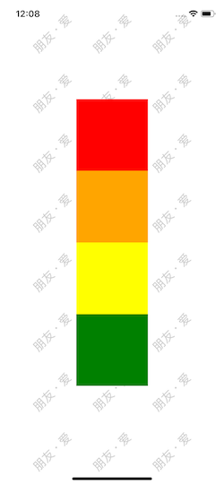
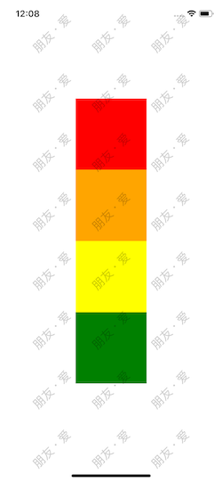

# Watermark(水印)

react-native项目中的水印插件（文字水印）

	npm install react-native-watermark-component

## 使用
使用起来也不麻烦，把`WatermarkView`当做普通`View`组件使用就行

	import { WatermarkView } from 'react-native-watermark-component';

	const {
      watermark = '朋友 · 爱',
      style = styles.container,
      itemWidth = 100,
      itemHeight = 100,
      rotateZ = -45,
      watermarkTextStyle = styles.watermarkTextStyle
    } = this.state;
    
	<WatermarkView
        foreground
        watermark={watermark}
        style={style}
        itemWidth={itemWidth}
        itemHeight={itemHeight}
        rotateZ={rotateZ}
        watermarkTextStyle={ watermarkTextStyle }
      >
        <View>
	        <Text>朋友 · 爱</Text>
        </View>
        {your_component}
        {/* 这里放置你自己的组件 */}
      </WatermarkView>

|props|type|default value|notes|
|:---:|:---:|:---:|:---:|
|foreground|bool|false|是否需要前置水印|
|style|ViewPropTypes.style|-||
|watermark|string|-|水印文本内容，为空字符串时不显示水印|
|itemWidth|number|160|单个水印的宽度|
|itemHeight|number|100|单个水印的高度|
|watermarkTextStyle|Text.propTypes.style|-|水印文本样式|
|rotateZ|number|-45|水印旋转角度|

